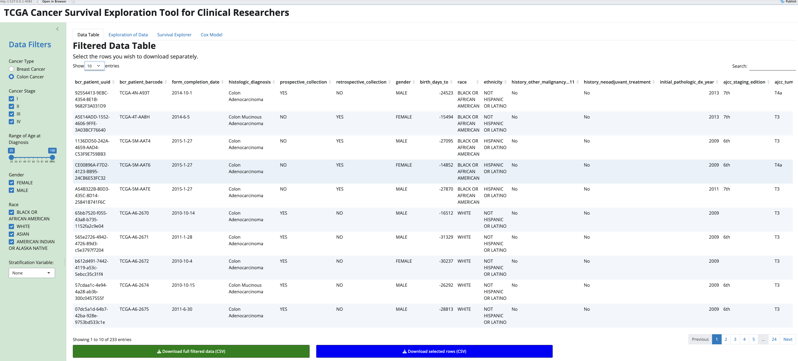
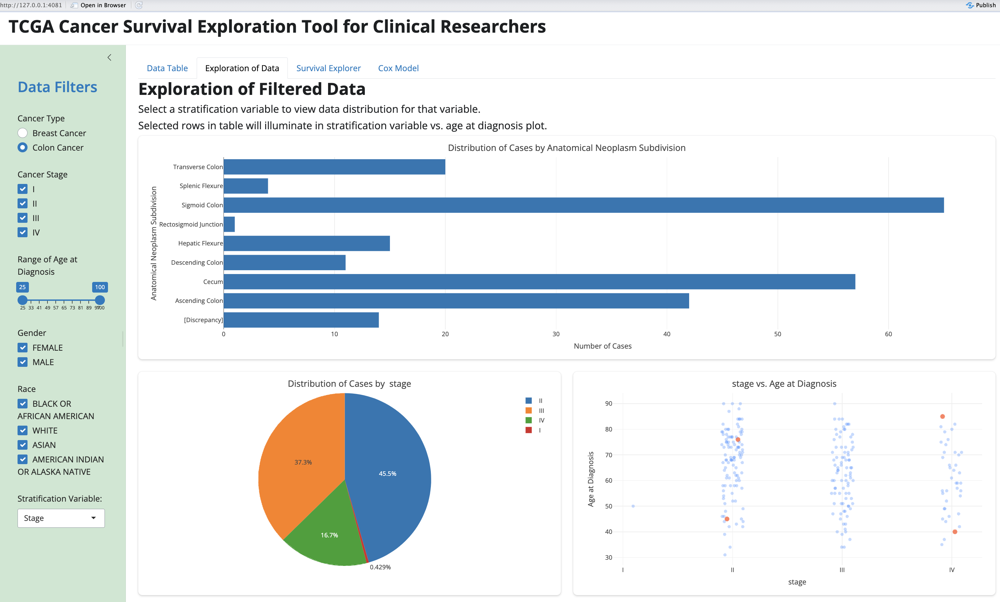
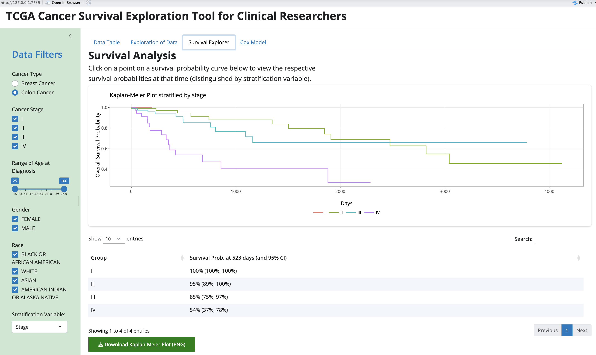
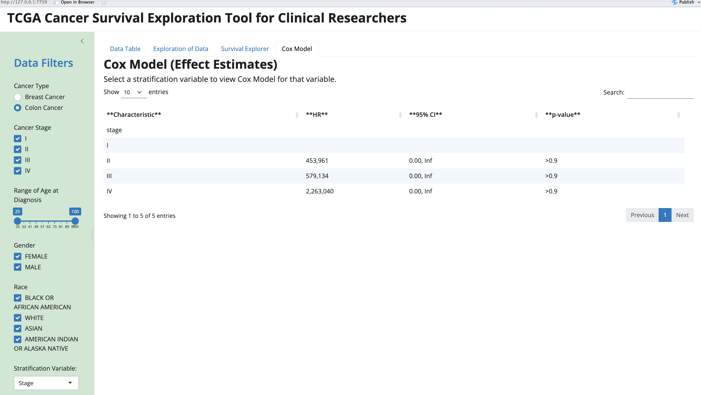

# TCGA Cancer Survival Exploration Tool for Clinical Researchers
### Rohan Krishnamurthi

## **Motivation & Background**

Oncology researchers seek to better understand trends in survival for patients affected by cancer. However, previous research has focused on trends for general populations affected by a specific type of cancer. Existing tools have not allowed oncology researchers to stratify their analyses on the basis of clinical factors. The purpose of this application is to provide clinical researchers with a tool that allows them to view trends in survival for cancer patients with specific demographic or clinical characteristics. This app stands out among other tools as it can allow researchers to examine and compare survival trends for specific populations affected by cancer. 

Oncology researchers and clinical scientists often need to understand how survival outcomes vary across specific patient subgroups, such as subgroups differing by stage at diagnosis, demographic characteristics, or treatments received. While numerous publications and static tools report survival outcomes for broad populations with a given cancer, few allow users to stratify outcomes by multiple clinical and demographic factors. This makes it difficult for researchers to quickly and flexibly explore hypotheses concerning how survival outcomes differ on the basis of clinical factors.

This app is an interactive Shiny dashboard that enables users to explore overall survival in TCGA breast and colon cancer patients using time-to-event methods. Core features include filtering by cancer stage, age at diagnosis, sex, and race; visualizing Kaplan-Meier survival curves stratified by user-selected variables; summarizing survival probabilities at user-selected time points; estimating hazard ratios from Cox regression models; and exporting filtered data for further analysis. 

The target users of this application are oncology and other clinical researchers who are interested in better understanding the survival outcomes of cancer subgroups. Intended use cases include quick hypothesis-generating exploration of survival patterns, teaching survival analysis concepts to other researchers and trainees, and visually examining potential survival disparities across clinical subgroups. In comparison to existing methods such as statis Kaplan-Meier plots, this app provides a simple interface that makes it easy to iteratively refine subgroups, visually and quantitatively compare multiple subgroups, and share analyses with other collaborators.

## **App Overview**

### Data Retrieval and Preprocessing

Two datasets from The Cancer Genome Atlas (TCGA) were used to develop this application. The first dataset was obtained from The Cancer Genome Atlas Breast Invasive Carcinoma (TCGA-BRCA), containing the clinical information of 1,099 patients with breast cancer. The second dataset was obtained from The Cancer Genome Atlas Colon Adenocarcinoma Collection (TCGA-COAD), containing the clinical information of 461 patients with colon cancer.

It was required for observations to have the `vital_status` and either `death_days_to` or `last_contact_days_to` variables non-missing in order to utilize these observations in the survival analysis. Thus, observations with these variables missing were removed from their respective datasets. 

Both datasets were further processed for consistency among variable names. The relevant variables of both datasets are as follows:

-`bcr_patient_uuid`: the patient ID number

-`status`: whether the patient is alive or dead

-`death_days_to`: days from diagnosis to death; only applicable to patients who have died

-`last_contact_days_to`: days from diagnosis to last contact with patients; only applicable to patients who are alive

-`time`: either days from diagnosis to death (if dead) or days from diagnosis to last contact (if alive)

-`age_at_diagnosis`: the patient's age at diagnosis of cancer

-`gender`: the patient's gender

-`race`: the patient's race

-`ajcc_pathologic_tumor_stage`: entered stage of cancer

-`stage`: simplified stage of cancer (I, II, III, or IV)

-`history_neoadjuvant_treatment`: if the patient has received neoadjuvant treatment or not

-`radiation_treatment_adjuvant`: if the patient has received radiation treatment or not

-`pharmaceutical_tx_adjuvant`: if the patient has received adjuvant pharmaceutical treatment or not

-`anatomic_neoplasm_subdivision`: subdivision of the cancer tumor

### Sidebar Panel and Data Table Tab

The sidebar to the left of the application contains several filters that users can select to narrow the data. Specifically, users can specify whether they would like to focus their analysis on breast cancer or colon cancer; which stage(s) of cancer, gender(s), and race(s) of patients they would like to include; and their preferred range for the age at diagnosis of patients. Moreover, there is an option to select a stratification variable (stage, gender, race, or treatment option), which will stratify the exploratory plots and survival analyses based on the levels of that variable. The stratification variable is particularly useful because it allows researchers to compare survival probabilities and risks among different groups, distinguished on the basis of cancer stage, gender, race, or treatment.

Data Table is the first tab of the application, showing the data after the filters have been applied. Should a user be interested in particular observations, either because of the individual patient circumstances or a different clinical reason, users can select individual rows in the data table. The observations selected will be highlighted in the plots on the following tab. The green button at the bottom of the page allows users to download the full filtered dataset, and the blue button allows them to download only the selected rows. This feature is beneficial in the event that the user would like to conduct further analyses on the filtered data.

### Exploration of Data Tab

Exploration of Data is the second tab of the application, containing exploratory plots of the filtered dataset. For the given cancer type, a horizontal bar chart is plotted to show the distribution of cases for each anatomic neoplasm subdivision. The anatomic neoplasm subdivision classifies cancerous tumors based on their location, size, and spread within the body. This information provides researchers with a better understanding of the frequency of specific tumor types among the patients. 

Users can then select a stratification variable to view the data distribution for that variable. This distribution is presented as a pie chart, with total counts and percentages shown upon hovering over a section of the pie chart. Additionally, a scatterplot comparing levels of the stratification variable with corresponding age at diagnosis values is presented to the right. Points initially appear as blue, but any poitns corresponding to rows selected in the Data Table Tab will become orange. This allows researchers to distinguish their observations of interest in the full scatterplot.

### Survival Explorer Tab

Survival Explorer is the third tab of the application, displaying a Kaplan-Meier plot. The Kaplan-Meier estimate, a non-parametric approach that results in a step function, is one of the most common ways to estimate survival times and probabilities. This method is widely used in clinical research.

With no stratification variable selected, the Kaplan-Meier plot will show the overall survival probability of patients in the filtered dataset over time. Time is measured in days since diagnosis of cancer. Upon selecting a stratification variable, the Kaplan-Meier plot will show survival probability curves for each group, or level, contained in the stratification variable. For example, if the stratification variable is set to "stage", the Kaplan-Meier plot will contain four survival curves for patients of stage I, II, III, and IV cancer.

Upon clicking on any point on any curve in the plot, the groups' respective survival probabilities at that time point will appear in a table below. As an example, if a user clicks on a survival curve in the plot at x = 500 days, a table will appear below the plot showing each group's survival probability at 500 days since diagnosis. This feature is useful to compare different groups' respective survivals at a specific point in time. 

Lastly, there is a green button at the bottom of the page that allows users to download the current survival plot as a PNG image.

### Cox Model Tab

Cox Model is the final tab of the application, showing the output of a Cox regression model. The Cox regression model is a semi-parametric model that computes the hard or instantaneous rate of death at a given time for a group of individuals. The quantity of interest of the Cox model output is the hazard ratio (HR), which represents a group's relative hazard or instantaneous rate of death in comparison to another group. If a group has a hazard < 1, it has a reduced hazard of death in comparison to the default group. 

To activate the Cox regression model in this tab, a stratification variable with at least two levels must be selected. Then, a table will appear with the Cox Model hazard ratios of the groups contained in the stratification variable. The first group will have no hazard ratio, as it is the default group to which the remaining groups are compared. The other groups will have a hazard ratio value, a 95% confidence interval for the HR, and a p-value indicating if the difference in hazard to the default group is significant or not. This feature is especially useful because researchers can utilize it to compare the rate of death of different groups and to determine if their difference is statistically significant. 

## **User Guide**

### 0. Sidebar Panel

First, users can use the Cancer Type buttons to focus their analysis on either breast cancer data (from TCGA-BRCA) or colon cancer data (from TCGA-COAD). Users can select which cancer stage(s) they would like to include in the analysis: I, II, III, and/or IV. Users can specify their preferred range of age at diagnosis from ages 25 to 100. Users can then select which gender(s) and race(s) they would like to include in their data. Lastly, users can select a stratification variable: stage, gender, race, adjuvant radiation treatment, adjuvant pharmaceutical treatment, or neoadjuvant treatment. This variable will be used to differentiate subsequent exploratory analyses and survival analyses.

### 1. Data Table Tab

Users can click the green button at the bottom of the page, "Download full filtered data (CSV)", to download the  dataset after the filters have been applied. Users can also select rows of interest to them; these observations will be highlighted in the exploratory plot on the following tab. Additionally, they can download the dataset of only the rows selected by clicking the blue button at the bottom of the page, "Download selected rows (CSV)".

### 2. Exploration of Data Tab

Users must select a stratification variable in the sidebar to view the data distribution for that variable. In the resulting pie chart showing the distribution for that variable, users can hover over sections to see the exact percentages and counts for that group. Moreover, in the scatterplot comparing groups of the stratification variable with the corresponding age at diagnosis, users can hover over a point to view the group and exact age.

### 3. Survival Explorer Tab

Users can leave the stratification variable empty to view a Kaplan-Meier plot showing the overall survival curve of all patients in the filtered dataset. Users can select a stratification variable to view a Kaplan-Meier plot showing the survival probability curves for each group contained in the stratification variable. For example, if the user sets the stratification variable to "stage", the Kaplan-Meier plot will show separte survival curves for patients of stage I, II, III, and IV cancer.

Users can click on any point on any curve in the plot to see each group's respective survival probability at that time point. As an example, if a user clicks on a survival curve in the plot at x = 500 days, a table will appear below the plot showing each group's survival probability at 500 days. 

Lastly, users can click the green button at the bottom of the page, "Download Kaplan-Meier Plot (PNG)", to download the current survival plot as a PNG image. 

### 4. Cox Model Tab

Users must initially select a stratification variable with at least two levels to utilize this tab. Once the stratification variable is specified, users will see the Cox regression model's relative hazard ratios for groups of the stratification variable, presented in the resulting table.

## References

Analyzing and Visualizing TCGA Data. Bioconductor. (n.d.). https://www.bioconductor.org/packages/devel/bioc/vignettes/TCGAbiolinks/inst/doc/analysis.html#TCGAanalyze_SurvivalKM:_Correlating_gene_expression_and_Survival_Analysis 

The Cancer Genome Atlas Program (TCGA). National Cancer Institute Center for Cancer Genomics. (n.d.). https://www.cancer.gov/ccg/research/genome-sequencing/tcga 

Colaprico, A., et. al. (2015). TCGAbiolinks: An R/bioconductor Package for Integrative Analysis of TCGA Data. Nucleic Acids Research, 44(8). https://doi.org/10.1093/nar/gkv1507 

Zabor, E. C. (n.d.). Survival Analysis in R. https://www.emilyzabor.com/survival-analysis-in-r.html 

---

_This project was crated as part of the BMI 709 course at Harvard Medical School._
